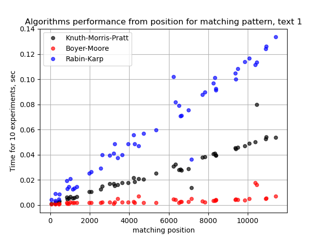
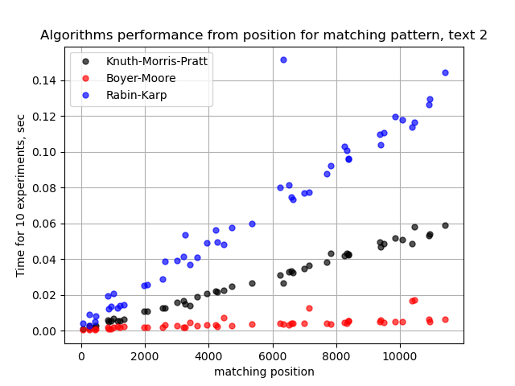
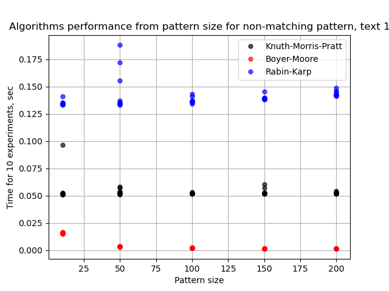
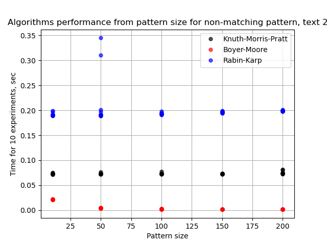
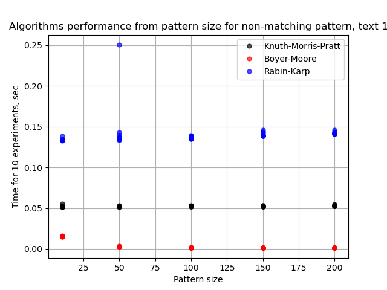
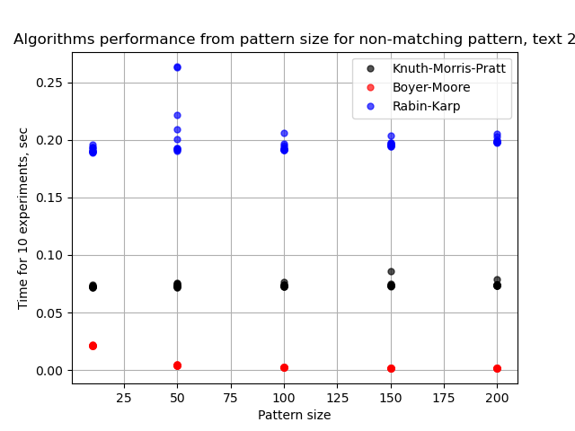

## Звіт до завдання 3

#### Методика тестування

Для кожного з наведених у завданні текстів ("01", "02")
   для різних довжин шаблону для пошуку
     проведено по 10 експериментів для кожного з наступних випадків:
       - шаблоном є підрядок у тексті з заданої позиції ("matching")
       - шаблоном є випадковий рядок, згенерований з усіх ASCII-символів ("random")
       - шаблоном є випадковий рядок, згенерований лише з 2 символів "a" та "b" ("ab")

#### Результати експериментів

| Text 1 | Text 2 |
| ---- | ---- |
| Matching pattern | Matching pattern |
|  |  |
|  |  |
| Random pattern from all ASCII characters | Random pattern from all ASCII characters |
|  |  |
| Random pattern from "ab" | Random pattern from "ab" |
|  |  |

#### Висновки

1. Довжина шаблона для порівняння за даними експериментів не впливає на швидкість роботи алгоритмів.
1. Місце першого входження шаблону очікувано впливає на швидкість повернення результату для кожного з алгоритмів.
1. За даними експерименту найшвидшим виявився алгоритм Боєра-Мура, на другому місці - алгоритм Кнута-Морріса-Пратта, найповільнішим був алгоритм Рабіна-Карпа.
1. 